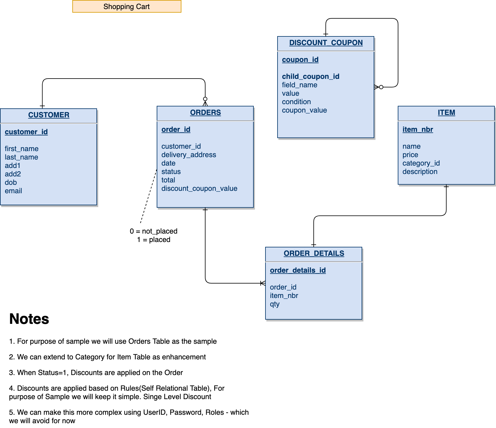

#Online Shopping Cart 


## Synopsis 
A simple Demo Shopping Cart using Spring Boot and Spring Data


## Access
This application can be run locally using the SpringBoot - `OnlineShoppingCartApplication` using your IDE of your choice

TODO :Docker Setup

While running you can navigate to the [Swagger UI](http://localhost:8080/swagger-ui.html), for the URI documentation.

To get a view of the DB Tables you can use the In Memory [H2 Console](http://localhost:8080/h2-console/).

You need to seed data into the database using the irrigation script. Please refer to ```resources\data.sql```


## ER Model


## Tests
The API provides a set of REST end-points :
### 1) View Available Items

URL : `GET /api/{version}/items`

Example : `GET /api/v1/items`

Response :
```
[
    {
    "item_nbr": 1111,
    "name": "Boomerang",
    "price": 10,
    "category_id": null,
    "description": "You get rid of it, but it keeps coming back"
    },
    {
    "item_nbr": 2222,
    "name": "Pogo Stick",
    "price": 34.5,
    "category_id": null,
    "description": "Jump high off the ground!"
    }
]
```